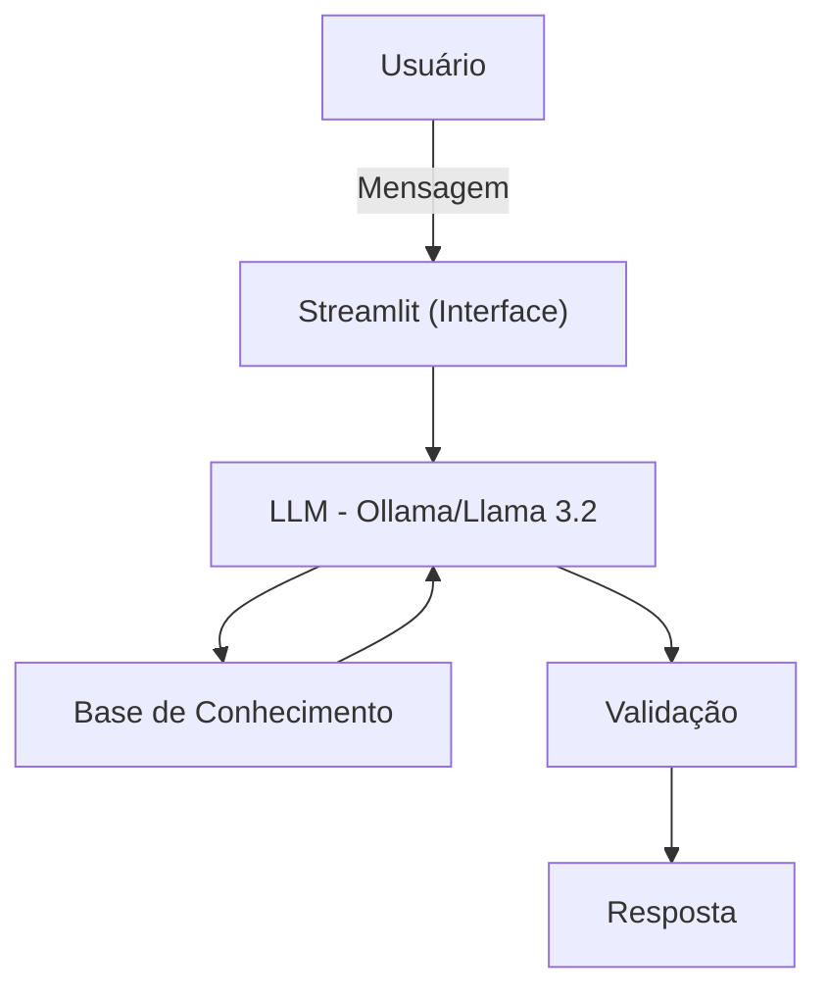

# 🎓 Renato, Seu Educador Financeiro

Agente de IA Generativa que ensina finanças pessoais de forma simples e personalizada, usando os próprios dados do cliente como exemplo prático — sem nunca recomendar investimentos.

> Projeto desenvolvido a partir do [Lab da DIO](https://github.com/digitalinnovationone/dio-lab-bia-do-futuro) — Agente Financeiro Inteligente com IA Generativa.


## O Problema

Muita gente quer aprender sobre finanças pessoais, mas não sabe por onde começar e tem receio de perguntar. O Renato existe para preencher essa lacuna: um educador disponível 24h, paciente e didático.

## Persona

- **Nome:** Renato
- **Papel:** Educador financeiro (não é consultor de investimentos)
- **Tom:** Informal, acessível, como um professor particular
- **Regra de ouro:** explica *como* cada produto funciona, mas nunca recomenda *onde* investir

## Arquitetura



| Componente | Tecnologia |
|---|---|
| Interface | Streamlit |
| LLM | Ollama (local, `llama3.2`) |
| Base de conhecimento | JSON/CSV mockados (`data/`) |

## Base de Conhecimento

| Arquivo | Uso |
|---|---|
| `perfil_investidor.json` | Personalizar explicações conforme o perfil do cliente |
| `transacoes.csv` | Analisar padrão de gastos de forma didática |
| `historico_atendimento.csv` | Dar continuidade a atendimentos anteriores |
| `produtos_financeiros.json` | Produtos disponíveis para ensinar (inclui FII no lugar de Fundo Multimercado) |

## Segurança e Anti-Alucinação

- Não recomenda investimentos específicos
- Não acessa dados sensíveis (senhas etc.)
- Admite quando não sabe algo
- Recusa perguntas fora do escopo de finanças pessoais

## Como Rodar

```bash
# 1. Instalar e preparar o Ollama
ollama pull llama3.2
ollama serve

# 2. Instalar dependências
pip install streamlit pandas requests

# 3. Rodar o app
streamlit run src/app.py
```

## Avaliação

Testado com cenários estruturados (consulta de gastos, tentativa de recomendação, pergunta fora de escopo, dado inexistente) — todos com resultado correto. Próximos passos: mais proatividade nas respostas e ampliação da base de conhecimento.

## Estrutura do Repositório

```
📁 data/    # Dados mockados do cliente
📁 docs/    # Documentação completa (persona, prompts, métricas, pitch)
📁 src/     # Código da aplicação (app.py)
```

📄 Documentação detalhada em [`docs/`](docs/) · 🚀 Pitch em [`docs/05-pitch.md`](docs/05-pitch.md)
